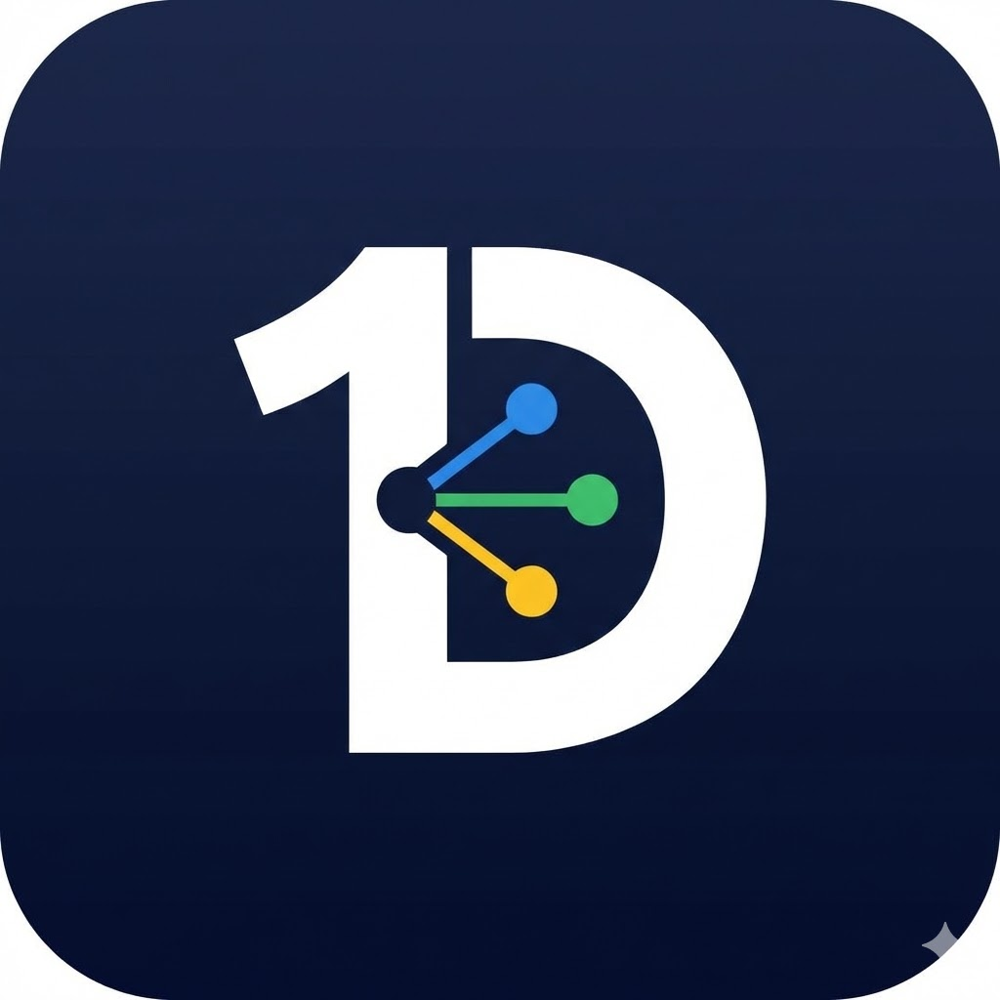

<p align="center">
  
</p>

<h1 align="center">DriveInOne</h1>

<p align="center">
  <strong>All your cloud photos. One app. AI-powered.</strong>
</p>

<p align="center">
  <a href="https://github.com/vibhorgupta96/DriveInOne/releases/latest">
    
  </a>
  
  
</p>

---

DriveInOne is a unified cloud photo & video gallery with AI-powered face recognition. Connect your Google Drive, OneDrive, and Dropbox accounts and browse all your media in one place — organized by timeline or by the people in your photos.

## Download

Grab the latest release APK from the [Releases](https://github.com/vibhorgupta96/DriveInOne/releases/latest) page.

## Features

- **Multi-Cloud Integration** — Link Google Drive, OneDrive, and Dropbox accounts and access all media from a single app
- **Unified Timeline** — Browse photos and videos chronologically across all connected providers
- **AI Face Recognition** — On-device face detection and embedding with MobileFaceNet, automatic clustering to group photos by person
- **People View** — See all recognized individuals and browse their photos
- **Catalog Search** — Search file names, paths, MIME types, providers, and linked accounts
- **Media Viewer** — Full-screen photo viewer with pinch-to-zoom and inline video playback
- **Offline Catalog** — Local SQLite metadata and cached previews remain available offline; opening an uncached original requires a connection
- **Secure Auth** — OAuth2 authentication with encrypted token storage

## Architecture

The project follows **Clean Architecture** with clearly separated layers:

```
lib/
├── core/                  # Constants, enums, errors, theme, utils
├── data/                  # Data layer
│   ├── database/          # Drift (SQLite) tables & DAOs
│   ├── datasources/
│   │   ├── cloud/         # Google Drive, OneDrive, Dropbox providers
│   │   └── local/         # Face detection, embeddings, secure storage
│   ├── models/            # Data models
│   └── repositories/      # Repository implementations
├── domain/                # Business logic (pure Dart)
│   ├── entities/          # Core entities
│   ├── repositories/      # Abstract repository interfaces
│   └── usecases/          # Auth, media, sync, face use cases
├── presentation/          # UI layer
│   ├── providers/         # Riverpod state management
│   ├── screens/           # Splash, home, timeline, people, search, settings, media viewer
│   └── widgets/           # Reusable UI components
├── app.dart               # App configuration & routing
└── main.dart              # Entry point & dependency injection
```

## Tech Stack

| Category | Libraries |
|---|---|
| State Management | Riverpod, Riverpod Generator |
| Routing | Go Router |
| Database | Drift (SQLite) |
| Networking | Dio, Cached Network Image |
| Auth | Google Sign-In, Flutter AppAuth, Flutter Secure Storage |
| AI / ML | Google ML Kit Face Detection, TFLite Flutter (MobileFaceNet) |
| Media | Video Player, Chewie, Photo View |
| Code Gen | Freezed, JSON Serializable, Build Runner |

## Getting Started

### Prerequisites

- Flutter >= 3.35.0
- Dart SDK >= 3.9.0
- iOS >= 15.5 (required by the ML Kit face detection dependency)

### Setup

```bash
git clone https://github.com/vibhorgupta96/DriveInOne.git
cd DriveInOne

# Install dependencies
flutter pub get

# Run code generation (Drift, Freezed, Riverpod, JSON)
dart run build_runner build --delete-conflicting-outputs

# Run the app
flutter run
```

### Cloud Provider Setup

Each cloud provider requires its own OAuth2 credentials:

| Provider | Console |
|---|---|
| Google Drive | [Google Cloud Console](https://console.cloud.google.com/) |
| OneDrive | [Azure Portal](https://portal.azure.com/) |
| Dropbox | [Dropbox App Console](https://www.dropbox.com/developers/apps) |

Copy the tracked example and add the public OAuth client identifiers registered
for your application. Native clients do not embed a Google client secret.

```bash
cp .env.example .env
# Edit .env with the three provider client IDs, then:
flutter run --dart-define-from-file=.env
```

The Android and iOS redirect URI for OneDrive and Dropbox is
`com.driveinone.app://oauth2redirect`; register it in both provider consoles.
For Google, register the Android package/signing certificate and the iOS URL
scheme for the corresponding native clients. For iOS, also copy
`ios/Flutter/OAuth.xcconfig.example` to `ios/Flutter/OAuth.xcconfig` and set
`GOOGLE_REVERSED_CLIENT_ID` to the reversed iOS client ID shown by Google.

### Building a Release APK

Create an upload keystore and copy `android/key.properties.example` to
`android/key.properties`. Fill in the local keystore path and passwords; both
the properties file and keystore are ignored by Git. Then build with:

```bash
flutter build apk --release --dart-define-from-file=.env
```

The APK will be at `build/app/outputs/flutter-apk/app-release.apk`.

Without `android/key.properties`, debug builds continue to work but release
artifacts are intentionally left unsigned rather than using the debug key.

## Quality Checks

Run the same checks used by CI before opening a pull request:

```bash
flutter pub get
dart format --output=none --set-exit-if-changed lib test
flutter analyze
flutter test
flutter build apk --debug
```

## License

This project is licensed under the MIT License. See [LICENSE](LICENSE) for details.
